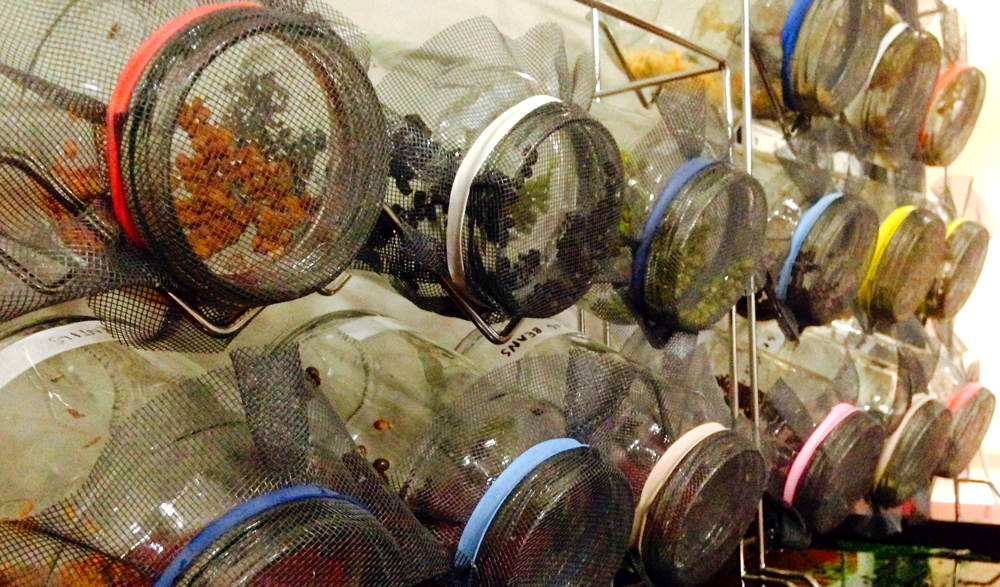

hydro45
=======

Hydroponic sustainable food supply.

###Getting Started

##### Materials:
- glass jars
- mesh screen, rubber bands
- container stand
- removable tray
- seeds
- fresh water
- airtight containers for storage

##### Step 1:
Place container stand over drainage tray provided. Put enough seeds (1 to 2 tsbsp. or 3 to 4 tsps., approximately 16-30 grams, depending on the seeds), to lightly cover the bottom surface of the upright jar(s).

##### Step 2:
Cover with mesh screen and secure with rubber band.

##### Step 3:
Rinse seeds of dirt and dust. Cover the seeds with about 2-4cm water and soak for a full 6-8 hours or overnight by leaving jars with the mouth up on the drainage tray.

##### Step 4:
Drain the water and rinse in fresh water swirling gently, while draining to disperse seeds across the bottom and sides of the jar.

##### Step 5:
Place jar(s) at angle with mouth down in container stand.

##### Step 6:
Rinse 2-3 times twice a day in cool water and put the jars back in the container stand in the same way.

##### Step 7:
Place jar in bright light (but not direct sunlight) to provide more greenery shortly before harvest to allow additional chlorophyll to form. Do not be afraid to experiment for optimal taste.

##### Step 8:
Enjoy in three to seven days. For a continuous suply of fresh sprouts sow new seeds every 2 to 3 days.

##### Step 9:
Drain well and to harvest cover the jar with a lid, or transfer to an airtight container. Refrigerate to store.

### Tips:
- Sprouts should smell clean and fresh, so be suspicious of unpleasant odors.
- Not all seeds will sprout.
- When rinsing the sprouts, be sure that the rinsed water is clear.
- Place mesh in a taut manner.

### Information:
www.kitchengarden.co.za

joseph@kitchengarden.co.za

Thank you for reading!
